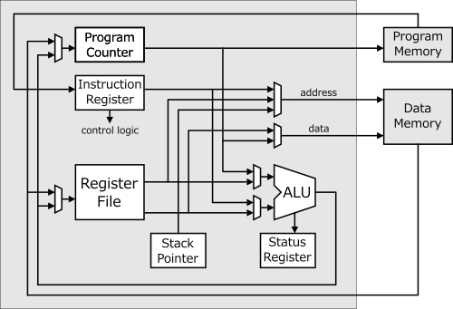

avr_cpu
=======

AVR microcontroller CPU core written in Verilog HDL.

* Instruction compatible with ATmega series
* Synthesizable with FPGA implementation software

Interface
---------

	module  CPU (
	    input           clock,      //  Master clock
	    input           reset,      //  Active high asynchronous reset
	    input   [15:0]  pm_rdata,   //  Program SRAM read data
	    output  [15:0]  pm_addr,    //  Program SRAM address
	    output          pm_re,      //  Program SRAM read enable
	    output          pm_we,      //  Program SRAM write enable
	    output  [15:0]  pm_wdata,   //  Program SRAM write data
	    input   [7:0]   dm_rdata,   //  Data SRAM read data
	    output  [15:0]  dm_addr,    //  Data SRAM address
	    output          dm_re,      //  Data SRAM read enable
	    output          dm_we,      //  Data SRAM write enable
	    output  [7:0]   dm_wdata,   //  Data SRAM write data
	    input   [7:0]   io_rdata,   //  I/O register read data
	    output  [7:0]   io_addr,    //  I/O register address
	    output          io_re,      //  I/O register read enable
	    output          io_we,      //  I/O register write enable
	    output  [7:0]   io_wdata,   //  I/O register write data
	    input           irq,        //  Interrupt request
	    input   [15:0]  irq_addr    //  Interrupt vector address
	);

Indicate the expected connection. 
Interrupt controller, I/O registers, and peripherals are created by the user.

Block Diagram
-------------

Notices
-------

Data memory map is as follows. Internal register file is not mapped.

	0x0000-0x001F  Reserved
	0x0020-0x00FF  I/O register
	0x0100-0xFFFF  Data SRAM

Stack pointer reset value is defined by parameter *CPU.SAS.SP_RESET*.
Its default value is *0x4FF*.

References
----------

* ATmega328/P Data Sheet
* AVR Instruction Set Manual
